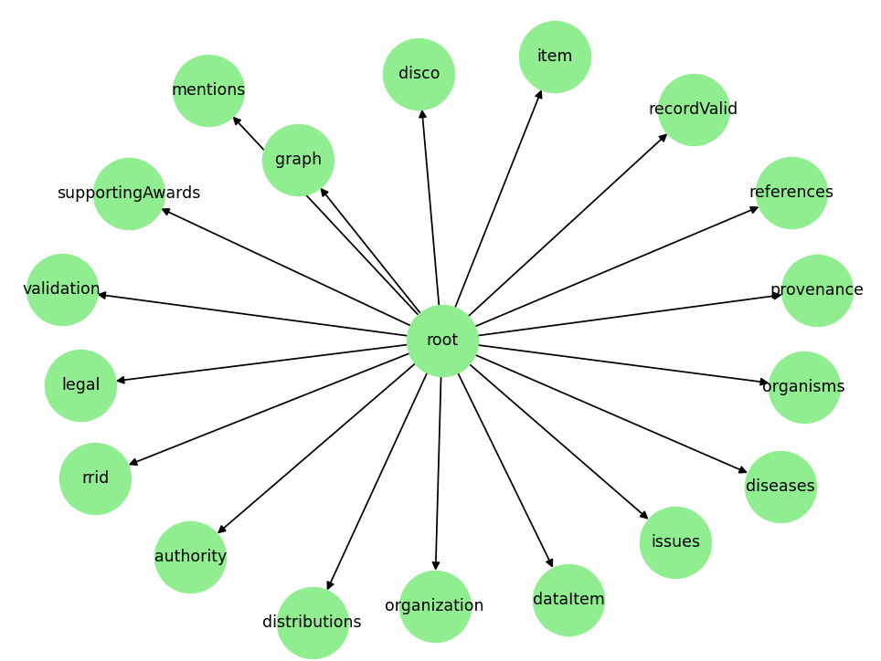

# JSON Structure Report

## Introduction
This report outlines the JSON structure that forms the basis for generating a knowledge graph. The graph will be integrated with Large Language Models (LLMs) using Retrieval Augmented Generation (RAG) techniques.

## JSON Structure Overview
- **Top-Level Entities**: These represent the main categories of data (e.g., `authority`, `item`, `distributions`) and are directly mapped to nodes in the graph database.
- **Nested Relationships**: Fields such as `related` and `abbreviations` denote relationships between entities, which become edges connecting the nodes.
- **Keys and References**: Unique keys (like identifiers or UUIDs) serve as node labels or properties, while reference fields establish explicit connections (edges) among the nodes.

The JSON data is organized into several top-level entities, each capturing a specific domain of information. Below is a summary of the key entities and their nested attributes:

- **authority** (dict)
  - **name** (str)

- **dataItem** (dict)
  - **dataTypes** (list)

- **disco** (dict)
  - **v_uuid** (str)

- **diseases** (dict)
  - **related** (list)
    - **name** (str)
    - **role** (str)

- **distributions** (dict)
  - **alternate** (list)
    - **uri** (str)
  - **current** (list)
    - **type** (str)
    - **uri** (str)
  - **deprecated** (list)
    - **uri** (str)

- **graph** (dict)
  - **relationships** (list)
    - **relationship** (dict)
      - **identifier** (str)
      - **name** (str)
    - **resource** (dict)
      - **identifier** (str)
      - **name** (str)

- **issues** (dict)
  - **status** (list)
  - **totalIssues** (dict)
    - **count** (int)

- **item** (dict)
  - **abbreviations** (list)
    - **name** (str)
  - **alternateIdentifiers** (list)
    - **identifier** (str)
  - **availability** (list)
    - **description** (str)
    - **keyword** (str)
  - **contentTypes** (list)
    - **curie** (str)
    - **name** (str)
  - **curie**, **description**, **docid**, **identifier**, **language**, **name**, **uuid** (str)
  - **keywords** (list)
    - **keyword** (str)
  - **supercategory** (list)
    - **name** (str)
    - **type** (str)
  - **synonyms** (list)
    - **name** (str)
  - **types** (list)
    - **name** (str)
    - **type** (str)

- **legal** (dict)
  - **license** (dict)
    - **name** (str)
  - **terms** (dict)
    - **uris** (list)

- **mentions** (list)
  - Each entry includes:
    - **availability** (dict)
      - **keyword** (str)
    - **timestamp** (str)
    - **totalMentions**, **totalRRIDMentions**, **totalResourceMentions** (dict)
      - **count** (int)

- **organisms** (dict)
  - **related** (list)
    - **role** (str)
    - **species** (dict)
      - **name** (str)

- **organization** (dict)
  - **hierarchy** (dict)

- **provenance** (dict)
  - **creationDate** (list)
  - **docId**, **filePattern**, **ingestMethod**, **ingestTarget**, **ingestTime**, **lastSeenDate**, **primaryKey** (str)

- **recordValid** (bool)

- **references** (list)
  - Each entry:
    - **curie** (str)

- **rrid** (dict)
  - **curie**, **is_unique**, **properCitation** (str)

- **supportingAwards** (list)
  - Each entry:
    - **agency** (dict)
      - **identifier** (str)
      - **name** (str)

- **validation** (dict)
  - **isValidated** (bool)
  - **totalValidationSites** (dict)
    - **count** (int)

## Structure Overview

